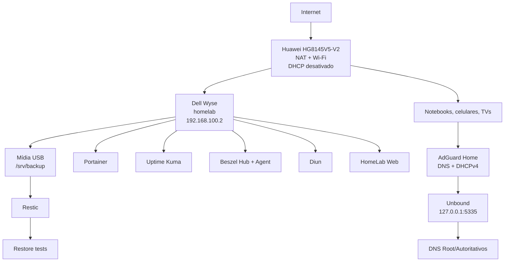

# HomeLab Infrastructure Server

Servidor doméstico de baixo consumo baseado em **Dell Wyse N03D / 3290**, **Ubuntu Server 24.04 LTS**, Docker e serviços de infraestrutura para a rede residencial.

## Objetivo

Centralizar no Dell Wyse os serviços essenciais da casa:

- DHCPv4 pelo AdGuard Home;
- DNS com bloqueio de anúncios e rastreadores;
- resolução DNS recursiva e cache local com Unbound;
- gerenciamento de containers pelo Portainer;
- monitoramento de disponibilidade pelo Uptime Kuma;
- métricas de host e containers pelo Beszel;
- detecção controlada de novas imagens com Diun;
- portal administrativo interno;
- firewall UFW;
- backup criptografado e restore test com Restic.

## Hardware do projeto

| Componente | Especificação |
|---|---|
| Equipamento | Dell Wyse N03D / 3290 |
| CPU | Intel Celeron N2807 @ 1.58 GHz |
| RAM | 4 GB DDR3 / 1333 MT/s |
| Armazenamento de produção | SATA Flash Drive 32 GB |
| Upgrade planejado | SSD 120 GB no fim de 2026 |
| Backup atual | Pendrive USB 128 GB, 117,2 GiB utilizáveis, validado com F3 |
| Rede principal | TP-Link UE300 USB 3.0 Gigabit Ethernet |
| Sistema | Ubuntu Server 24.04.4 LTS amd64 |
| Hostname | `homelab` |
| BIOS observada | Phoenix SecureCore 1.0R (2017-12-22) |

Identificadores únicos de hardware, MAC addresses, tokens, hashes e senhas não devem ser publicados no repositório.

## Endereçamento

| Item | Valor |
|---|---|
| Rede | `192.168.100.0/24` |
| Gateway Huawei | `192.168.100.1` |
| HomeLab | `192.168.100.2` |
| Pool DHCP | `192.168.100.50` a `192.168.100.200` |
| Domínio local | `home.arpa` |
| Unbound | `127.0.0.1:5335` |

## Tempo e agendamentos

A referência temporal do host foi auditada e validada:

| Item | Estado |
|---|---|
| Timezone | `America/Sao_Paulo` |
| Offset local | `-03:00` |
| `/etc/localtime` | `America/Sao_Paulo` |
| `/etc/timezone` | `America/Sao_Paulo` |
| RTC | UTC |
| RTC em hora local | não |
| NTP | `systemd-timesyncd` ativo e sincronizado |

Containers podem operar internamente em UTC quando não possuem agendamento local. O Diun possui `TZ=America/Sao_Paulo` explicitamente porque executa checagem agendada.

## Serviços atuais

| Serviço | Função | Acesso |
|---|---|---|
| AdGuard Home | DNS + DHCPv4 | `http://192.168.100.2` |
| Unbound | DNS recursivo/cache | `127.0.0.1:5335` |
| Portainer | Gerência Docker | `https://192.168.100.2:9443` |
| Uptime Kuma | Disponibilidade | `http://192.168.100.2:3001` |
| Beszel | Métricas | `http://192.168.100.2:8090` |
| Beszel Agent | Coleta local | WebSocket-only |
| Diun | Notificação de imagens | sem porta publicada |
| HomeLab Web | Portal interno | `http://192.168.100.2:8080` |
| Restic | Backup/restore | `/srv/backup` |

## Arquitetura



## Decisões técnicas

1. O Wyse opera por Ethernet; Wi-Fi não participa da infraestrutura crítica.
2. O DHCP do Huawei está desativado; o AdGuard fornece DHCPv4.
3. O AdGuard usa `network_mode: host` e upstream somente no Unbound local.
4. O Unbound roda nativamente em `127.0.0.1:5335`.
5. Uptime Kuma monitora disponibilidade; Beszel monitora recursos.
6. Beszel Agent opera em WebSocket-only com SSH interno desativado.
7. Diun apenas notifica; containers são atualizados manualmente após backup/revisão.
8. Interfaces administrativas ficam somente na LAN e não há port forwarding no modem.
9. UFW bloqueia entrada por padrão e possui regras específicas para LAN e checks Docker -> host.
10. Restic cancela o backup se `/srv/backup` não estiver montado.
11. A senha Restic, senhas administrativas, tokens e hashes não são versionados.
12. O AdGuard está configurado com `auth_attempts: 5` e `block_auth_min: 3`.
13. SSH remoto aceita chave pública e rejeita autenticação por senha e keyboard-interactive; login root remoto está desativado.
14. Atualizações automáticas de segurança estão ativas sem reboot automático não supervisionado.
15. O host usa `America/Sao_Paulo`, RTC em UTC e NTP sincronizado.
16. O upgrade para SSD de 120 GB será usado como exercício de disaster recovery.

## Documentação

1. [Arquitetura](docs/00-Arquitetura.md)
2. [Hardware](docs/01-Hardware.md)
3. [Instalação do Ubuntu](docs/02-Instalacao-Ubuntu.md)
4. [Configuração inicial e IP](docs/03-Configuracao-Inicial.md)
5. [Docker Engine e Compose](docs/04-Docker.md)
6. [Portainer](docs/05-Portainer.md)
7. [AdGuard Home](docs/06-AdGuardHome.md)
8. [Unbound](docs/07-Unbound.md)
9. [DHCP](docs/08-DHCP.md)
10. [Uptime Kuma](docs/09-Uptime-Kuma.md)
11. [Beszel](docs/09-Beszel.md)
12. [Diun](docs/10-Diun.md)
13. [UFW](docs/11-UFW.md)
14. [Backup e restauração](docs/12-Backup.md)
15. [Manutenção](docs/13-Manutencao.md)
16. [Troubleshooting](docs/14-Troubleshooting.md)
17. [Upgrades](docs/15-Upgrade.md)
18. [Mídia USB e Restic](docs/16-HD-Externo-Backup.md)
19. [Horário e agendamentos](docs/17-Horario-Agendamentos.md)

## Backup

| Rotina | Agendamento |
|---|---:|
| Restic backup | diariamente às 03:15 + jitter de até 5 min |
| Manutenção | domingo às 04:30 + jitter de até 10 min |
| Restore test | dia 1 às 05:30 + jitter de até 15 min |

Retenção:

- 7 diários;
- 8 semanais;
- 12 mensais;
- 2 anuais.

Ciclo validado:

```text
Snapshot inicial       a79a4c33
Snapshot automático    85e06611
Restic check            no errors were found
Restore                 604 files/dirs, 5.878 MiB
Marker                  RESTORE_TEST_OK.txt
```

O snapshot automático foi criado pelo `homelab-backup.timer`, confirmando a execução real do agendamento systemd.

## Estrutura principal

```text
.
├── README.md
├── compose/
│   ├── compose.yaml
│   └── .env.example
├── config/
│   ├── restic/
│   └── unbound/
├── docs/
├── scripts/
├── systemd/
└── web/
```

`compose/compose.yaml` é o único arquivo Compose oficial da stack. Arquivos Compose legados não devem ser mantidos em paralelo.

## Uso rápido

```bash
git clone https://github.com/leonardodebs/homelab-infrastructure-server.git
cd homelab-infrastructure-server
sudo bash scripts/bootstrap-host.sh
bash scripts/install-docker.sh
```

Crie o arquivo local de ambiente:

```bash
cp compose/.env.example compose/.env
nano compose/.env
```

Não versione `compose/.env`.

## Mídia de backup

Identifique localmente o dispositivo antes de qualquer operação destrutiva:

```bash
lsblk -o NAME,SIZE,TYPE,FSTYPE,LABEL,MOUNTPOINT,MODEL,TRAN,RM
```

Depois consulte `docs/16-HD-Externo-Backup.md`.

## Estado do projeto

- [x] Arquitetura definida e revisada
- [x] Hardware recebido e validado
- [x] Ubuntu Server 24.04.4 LTS instalado
- [x] Hostname `homelab`
- [x] IP estático `192.168.100.2`
- [x] Docker Engine e Compose instalados
- [x] Portainer instalado
- [x] Unbound validado
- [x] AdGuard Home validado
- [x] DHCP migrado para o AdGuard
- [x] DNS/bloqueio validado nos clientes
- [x] Uptime Kuma com monitores validados
- [x] Beszel Hub + Agent validados
- [x] Diun validado
- [x] HomeLab Web operacional
- [x] UFW aplicado e validado
- [x] Mídia USB 128 GB validada com F3 e ext4
- [x] Restic e timers ativos
- [x] Primeiro snapshot e `restic check` validados
- [x] Backup automático por systemd validado
- [x] Restore test validado
- [x] SSH por chave validado e autenticação por senha desativada
- [x] `unattended-upgrades` auditado e operacional sem reboot automático
- [x] Timezone, RTC, NTP, timers e schedulers auditados
- [x] Documentação técnica revisada para refletir a implantação real
- [ ] Burn-in de estabilidade por 48–72 horas
- [ ] Evidências/capturas de tela para portfólio
- [ ] Upgrade futuro para SSD de 120 GB

## Referências oficiais

- Ubuntu Server: https://documentation.ubuntu.com/server/
- Docker Engine: https://docs.docker.com/engine/install/ubuntu/
- AdGuard Home: https://github.com/AdguardTeam/AdGuardHome/wiki
- Unbound: https://unbound.docs.nlnetlabs.nl/
- Portainer: https://docs.portainer.io/
- Uptime Kuma: https://github.com/louislam/uptime-kuma
- Beszel: https://beszel.dev/
- Diun: https://crazymax.dev/diun/
- Restic: https://restic.readthedocs.io/en/stable/
- systemd.timer: https://www.freedesktop.org/software/systemd/man/latest/systemd.timer.html
- smartmontools: https://www.smartmontools.org/
