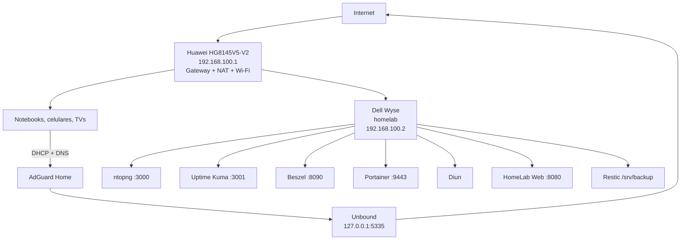

# HomeLab Infrastructure Server

Servidor doméstico de baixo consumo baseado em **Dell Wyse N03D / 3290**, **Ubuntu Server 24.04 LTS**, Docker e serviços de infraestrutura para a rede residencial.

## Objetivo

Centralizar serviços essenciais da rede doméstica no HomeLab:

- DHCPv4 e filtragem DNS com AdGuard Home;
- resolução DNS recursiva com Unbound;
- gerenciamento Docker com Portainer;
- disponibilidade com Uptime Kuma;
- métricas do host e containers com Beszel;
- análise de tráfego e hosts com ntopng;
- detecção de novas imagens com Diun;
- firewall UFW;
- portal administrativo interno;
- backup criptografado e restore test com Restic.

## Hardware e rede

| Item | Estado atual |
|---|---|
| Equipamento | Dell Wyse N03D / 3290 |
| CPU | Intel Celeron N2807 @ 1.58 GHz |
| RAM | 4 GB DDR3 |
| Armazenamento interno | SATA Flash 32 GB |
| Backup | mídia USB 128 GB em ext4 |
| Rede principal | TP-Link UE300 USB 3.0 Gigabit Ethernet |
| Sistema | Ubuntu Server 24.04.4 LTS |
| Hostname | `homelab` |
| Rede | `192.168.100.0/24` |
| Gateway | `192.168.100.1` |
| HomeLab | `192.168.100.2` |
| Pool DHCP | `192.168.100.50-192.168.100.200` |

O Wi-Fi do Dell não participa da infraestrutura crítica. Identificadores únicos de hardware, MAC addresses, tokens, hashes e senhas não devem ser publicados no repositório.

## Serviços atuais

| Serviço | Função | Acesso |
|---|---|---|
| AdGuard Home | DNS + DHCPv4 | `http://192.168.100.2` |
| Unbound | DNS recursivo/cache | `127.0.0.1:5335` |
| ntopng | análise de tráfego/hosts | `http://192.168.100.2:3000` |
| Uptime Kuma | disponibilidade | `http://192.168.100.2:3001` |
| HomeLab Web | portal interno | `http://192.168.100.2:8080` |
| Beszel | métricas | `http://192.168.100.2:8090` |
| Portainer | gerência Docker | `https://192.168.100.2:9443` |
| Diun | notificação de imagens | sem porta publicada |
| Restic | backup/restore | `/srv/backup` |

## Arquitetura



## Observabilidade

A observabilidade foi dividida por responsabilidade:

- **AdGuard Home:** consultas DNS, DHCP e políticas por cliente;
- **Uptime Kuma:** disponibilidade de serviços e conectividade;
- **Beszel:** CPU, RAM, disco, temperatura e containers;
- **ntopng:** análise de tráfego, hosts, protocolos e fluxos visíveis pela interface monitorada.

O ntopng foi instalado nativamente no Ubuntu, está acessível pela porta `3000/tcp` somente na LAN e teve dashboard/filtros validados.

### Limitação do ntopng

O Dell Wyse não é o gateway da residência. O Huawei continua como gateway/NAT em `192.168.100.1`. Portanto, o ntopng não captura automaticamente todo o tráfego entre clientes e Internet.

Para visibilidade integral da LAN será necessária uma evolução como gateway/firewall dedicado, switch com SPAN/port mirroring ou tecnologia equivalente de exportação de fluxos.

## Segurança

- UFW com entrada padrão negada;
- interfaces administrativas limitadas à LAN;
- porta `3000/tcp` liberada somente para o ntopng na LAN;
- sem port forwarding administrativo no modem;
- SSH por chave ED25519;
- autenticação SSH por senha e keyboard-interactive desativadas;
- login root remoto desativado;
- atualizações automáticas de segurança ativas sem reboot automático não supervisionado.

## DNS e DHCP

O DHCPv4 do Huawei foi desativado e migrado para o AdGuard Home.

Fluxo DNS:

```text
Cliente -> AdGuard Home -> Unbound -> DNS raiz/autoritativos
```

O AdGuard aplica listas de bloqueio, regras locais e políticas por cliente. O Unbound resolve recursivamente, valida DNSSEC e mantém cache local.

## Backup

| Rotina | Agendamento |
|---|---|
| Backup Restic | diariamente às 03:15 + jitter de até 5 min |
| Manutenção | domingo às 04:30 + jitter de até 10 min |
| Restore test | dia 1 às 05:30 + jitter de até 15 min |

Retenção: 7 diários, 8 semanais, 12 mensais e 2 anuais.

Já foram validados snapshot inicial, snapshot automático pelo systemd, `restic check` sem erros e restore test em diretório isolado.

## Tempo

- timezone: `America/Sao_Paulo`;
- RTC em UTC;
- NTP sincronizado por `systemd-timesyncd`;
- timers e schedulers auditados;
- containers podem operar em UTC quando não dependem de horário local;
- Diun utiliza explicitamente `America/Sao_Paulo`.

## Documentação

1. [Arquitetura](docs/00-Arquitetura.md)
2. [Hardware](docs/01-Hardware.md)
3. [Instalação do Ubuntu](docs/02-Instalacao-Ubuntu.md)
4. [Configuração inicial](docs/03-Configuracao-Inicial.md)
5. [Docker](docs/04-Docker.md)
6. [Portainer](docs/05-Portainer.md)
7. [AdGuard Home](docs/06-AdGuardHome.md)
8. [Unbound](docs/07-Unbound.md)
9. [DHCP](docs/08-DHCP.md)
10. [Uptime Kuma](docs/09-Uptime-Kuma.md)
11. [Beszel](docs/09-Beszel.md)
12. [Diun](docs/10-Diun.md)
13. [UFW](docs/11-UFW.md)
14. [Backup e restauração](docs/12-Backup.md)
15. [Manutenção](docs/13-Manutencao.md)
16. [Troubleshooting](docs/14-Troubleshooting.md)
17. [Upgrades](docs/15-Upgrade.md)
18. [Mídia USB e Restic](docs/16-HD-Externo-Backup.md)
19. [Horário e agendamentos](docs/17-Horario-Agendamentos.md)
20. [ntopng e observabilidade de rede](docs/18-ntopng.md)

## Estado do projeto

- [x] Ubuntu Server, hostname e IP estático
- [x] Docker Engine e Compose
- [x] AdGuard Home + DHCPv4
- [x] Unbound
- [x] Portainer
- [x] Uptime Kuma
- [x] Beszel Hub + Agent
- [x] ntopng e porta `3000/tcp` na LAN
- [x] Diun
- [x] HomeLab Web
- [x] UFW
- [x] SSH hardening
- [x] unattended-upgrades
- [x] timezone/NTP/RTC auditados
- [x] mídia USB e Restic
- [x] backup automático
- [x] `restic check`
- [x] restore test
- [x] documentação técnica consolidada
- [ ] burn-in de estabilidade por 48–72 horas
- [ ] evidências/capturas para portfólio
- [ ] evolução futura para gateway/firewall dedicado ou captura integral da LAN
- [ ] upgrade futuro para SSD de 120 GB
