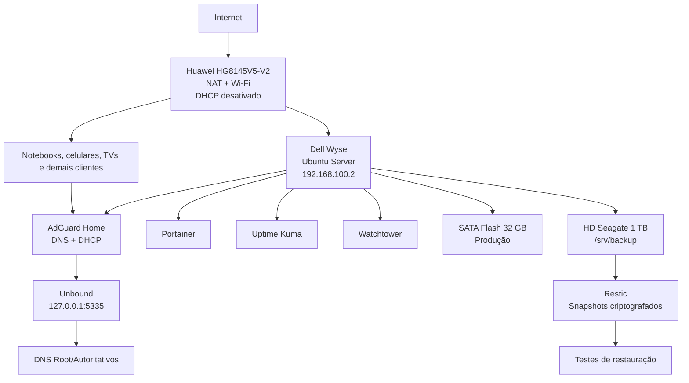

# HomeLab Infrastructure Server

Servidor doméstico de baixo consumo baseado em **Dell Wyse N03D / 3290**, **Ubuntu Server 24.04 LTS**, Docker e serviços de infraestrutura para a rede residencial.

## Objetivo

Centralizar no Dell Wyse os serviços essenciais da casa:

- DHCP para distribuição automática de IP, gateway e DNS;
- DNS com bloqueio de anúncios e rastreadores pelo AdGuard Home;
- resolução DNS recursiva e cache local com Unbound;
- gerenciamento de containers pelo Portainer;
- monitoramento pelo Uptime Kuma;
- verificação controlada de atualizações com Watchtower;
- firewall, backups e manutenção documentada;
- recuperação local por HD externo com Restic.

## Hardware do projeto

| Componente | Especificação |
|---|---|
| Equipamento | Dell Wyse N03D / 3290 |
| CPU | Intel Celeron N2807 @ 1.58 GHz |
| RAM | 4 GB DDR3 / 1333 MT/s |
| Armazenamento de produção atual | SATA Flash Drive 32 GB |
| Upgrade planejado | SSD 120 GB no fim de 2026 |
| Armazenamento de backup | HD externo Seagate 1 TB via USB |
| Rede principal | Ethernet |
| Recursos extras | HDMI, VGA, USB e Wi-Fi |
| Sistema alvo | Ubuntu Server 24.04 LTS amd64 |
| BIOS observada | Phoenix SecureCore, versão 1.0R (2017-12-22) |

> O equipamento chegou com Windows 10 Pro instalado no SATA Flash de 32 GB. O plano atual é apagar o Windows e instalar o Ubuntu Server diretamente nesse disco. O SSD de 120 GB será um upgrade futuro, não um pré-requisito para iniciar o HomeLab.

## Endereçamento adotado

| Item | Valor de referência |
|---|---|
| Rede | `192.168.100.0/24` |
| Modem/gateway | `192.168.100.1` |
| Dell Wyse | `192.168.100.2` |
| Pool DHCP | `192.168.100.50` a `192.168.100.200` |
| Domínio local opcional | `home.arpa` |

Adapte os valores antes da instalação caso a sua rede use outra faixa.

## Arquitetura



## Decisões técnicas importantes

1. O Wyse deve usar **Ethernet** e IP estático. O Wi-Fi fica apenas como contingência.
2. O DHCP do modem só será desligado depois que o AdGuard Home estiver testado.
3. O AdGuard Home usa `network_mode: host`, requisito recomendado para DHCP e identificação real dos clientes.
4. O Unbound roda como serviço nativo do Ubuntu em `127.0.0.1:5335`.
5. O Watchtower não atualiza automaticamente o DNS/DHCP. Serviços críticos são atualizados manualmente após backup.
6. Portas administrativas ficam disponíveis somente na rede local e nenhuma porta deve ser encaminhada no modem para a Internet.
7. O SATA Flash de 32 GB é o ambiente de produção inicial; o HD externo de 1 TB é o ambiente de recuperação.
8. O backup é cancelado se `/srv/backup` não estiver montado, evitando gravar acidentalmente no armazenamento interno.
9. A senha Restic não é armazenada no repositório e precisa ser guardada fora do servidor.
10. O upgrade para SSD de 120 GB está planejado para o fim de 2026 e será tratado como exercício de disaster recovery/restauração.

## Ordem de implantação

1. [Arquitetura](docs/00-Arquitetura.md)
2. [Hardware e checklist de chegada](docs/01-Hardware.md)
3. [Instalação do Ubuntu Server](docs/02-Instalacao-Ubuntu.md)
4. [Configuração inicial e IP estático](docs/03-Configuracao-Inicial.md)
5. [Docker Engine e Compose](docs/04-Docker.md)
6. [Portainer](docs/05-Portainer.md)
7. [AdGuard Home](docs/06-AdGuardHome.md)
8. [Unbound](docs/07-Unbound.md)
9. [Migração do DHCP](docs/08-DHCP.md)
10. [Uptime Kuma](docs/09-Uptime-Kuma.md)
11. [Watchtower](docs/10-Watchtower.md)
12. [Firewall UFW](docs/11-UFW.md)
13. [Backup e restauração](docs/12-Backup.md)
14. [Manutenção](docs/13-Manutencao.md)
15. [Troubleshooting](docs/14-Troubleshooting.md)
16. [Upgrades futuros](docs/15-Upgrade.md)
17. [HD externo e stack Restic](docs/16-HD-Externo-Backup.md)

## Stack de backup externo

| Rotina | Agendamento | Resultado |
|---|---:|---|
| Backup Restic | diariamente às 03:15 | snapshot criptografado e incremental |
| Manutenção | domingo às 04:30 | retenção, prune, check parcial e SMART |
| Restore test | dia 1 às 05:30 | restauração em diretório isolado |

Retenção padrão:

- 7 snapshots diários;
- 8 semanais;
- 12 mensais;
- 2 anuais.

## Estrutura do repositório

```text
.
├── README.md
├── compose/
│   ├── compose.yaml
│   └── .env.example
├── config/
│   ├── restic/
│   │   ├── excludes.txt
│   │   └── restic.env.example
│   └── unbound/
│       └── homelab.conf
├── docs/
├── scripts/
│   ├── bootstrap-host.sh
│   ├── install-docker.sh
│   ├── deploy-stack.sh
│   ├── prepare-backup-disk.sh
│   ├── install-backup-stack.sh
│   ├── restic-backup.sh
│   ├── restic-maintenance.sh
│   ├── restic-restore-test.sh
│   ├── smart-check.sh
│   ├── backup.sh
│   ├── restore.sh
│   ├── update-stack.sh
│   └── healthcheck.sh
└── systemd/
    ├── homelab-backup.service
    ├── homelab-backup.timer
    ├── homelab-backup-maintenance.service
    ├── homelab-backup-maintenance.timer
    ├── homelab-restore-test.service
    └── homelab-restore-test.timer
```

## Uso rápido

Depois de concluir a configuração do Ubuntu e do IP estático:

```bash
git clone https://github.com/leonardodebs/homelab-infrastructure-server.git
cd homelab-infrastructure-server
chmod +x scripts/*.sh
sudo ./scripts/bootstrap-host.sh
./scripts/install-docker.sh
```

Copie o arquivo de ambiente e ajuste o IP:

```bash
cp compose/.env.example compose/.env
nano compose/.env
```

Depois instale o Unbound e suba a stack conforme os capítulos 7 e 6.

## Instalação do HD externo

Depois que os serviços estiverem estáveis:

```bash
lsblk -o NAME,SIZE,TYPE,FSTYPE,LABEL,MOUNTPOINT,MODEL,SERIAL,TRAN
sudo ./scripts/prepare-backup-disk.sh /dev/sdX
sudo ./scripts/install-backup-stack.sh
sudo systemctl start homelab-backup.service
```

O comando de preparação é destrutivo e exige que o disco correto seja identificado pelo modelo, capacidade e serial. Consulte o [capítulo 16](docs/16-HD-Externo-Backup.md) antes de executar.

## Aviso sobre o corte de DHCP

Nunca desative o DHCP do modem antes de:

- fixar o IP do Wyse;
- validar o AdGuard Home na porta 53;
- configurar e testar o DHCP do AdGuard;
- manter um notebook com IP manual de emergência.

## Estado do projeto

- [x] Arquitetura definida
- [x] Documentação inicial
- [x] Compose dos serviços
- [x] Scripts operacionais
- [x] Stack de backup externo documentada
- [x] Timers de backup, manutenção e restore test
- [x] Hardware recebido e ligado
- [x] BIOS acessada e hardware básico validado
- [x] SATA Flash de 32 GB reconhecido pela BIOS
- [ ] Instalação do Ubuntu Server 24.04 LTS
- [ ] Testes dos serviços no hardware real
- [ ] Formatação e validação do HD externo real
- [ ] Evidências e capturas de tela da implantação
- [ ] Upgrade futuro para SSD de 120 GB

## Referências oficiais

- Ubuntu Server: https://documentation.ubuntu.com/server/
- Docker Engine: https://docs.docker.com/engine/install/ubuntu/
- AdGuard Home: https://github.com/AdguardTeam/AdGuardHome/wiki
- Unbound: https://unbound.docs.nlnetlabs.nl/
- Portainer: https://docs.portainer.io/
- Uptime Kuma: https://github.com/louislam/uptime-kuma
- Watchtower: https://containrrr.dev/watchtower/
- OISD: https://oisd.nl/setup/adguardhome
- Restic: https://restic.readthedocs.io/en/stable/
- systemd.timer: https://www.freedesktop.org/software/systemd/man/latest/systemd.timer.html
- smartmontools: https://www.smartmontools.org/
