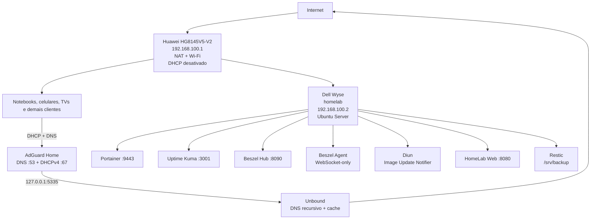

# 00 — Arquitetura

## Objetivo

Transformar o Dell Wyse em servidor de infraestrutura doméstica de baixo consumo, mantendo o Huawei HG8145V5-V2 como gateway, NAT e ponto de acesso Wi-Fi.

## Estado atual validado

### Huawei HG8145V5-V2

- acesso à Internet;
- NAT;
- Wi-Fi;
- gateway `192.168.100.1`;
- DHCPv4 desativado após a migração para o AdGuard Home.

### Dell Wyse N03D / 3290

- Ubuntu Server 24.04.4 LTS;
- hostname `homelab`;
- IP estático `192.168.100.2`;
- Ethernet principal via adaptador USB TP-Link UE300;
- Docker Engine e Compose;
- Portainer;
- AdGuard Home como DNS e DHCPv4;
- Unbound como resolvedor DNS recursivo local;
- Uptime Kuma para disponibilidade;
- Beszel Hub + Agent para métricas do host e containers;
- Diun para detecção de novas imagens;
- HomeLab Web como portal interno;
- UFW como firewall do host;
- Restic em mídia USB dedicada para backup e restore test.

## Topologia



## Fluxo DHCP

1. O cliente entra na rede.
2. O AdGuard Home entrega:
   - IP no pool `192.168.100.50-192.168.100.200`;
   - máscara `/24`;
   - gateway `192.168.100.1`;
   - DNS `192.168.100.2`;
   - domínio local `home.arpa`.
3. O servidor permanece fora do pool DHCP.
4. Reservas podem ser usadas para clientes que precisem de IP previsível.

## Fluxo DNS

```text
Cliente -> AdGuard Home -> Unbound -> servidores raiz/autoritativos
```

O AdGuard aplica listas de bloqueio, regras locais e políticas por cliente. Consultas permitidas seguem para o Unbound, que resolve recursivamente, valida DNSSEC e mantém cache local.

## Observabilidade

- Uptime Kuma verifica gateway, Internet, DNS e interfaces web;
- Beszel registra CPU, RAM, swap, disco, rede, temperatura e containers;
- o portal HomeLab centraliza os links administrativos;
- logs do Docker e do systemd permanecem disponíveis para troubleshooting.

## Atualizações de containers

O Diun consulta os registries e detecta mudanças nas imagens marcadas com `diun.enable=true`.

Ele não atualiza containers automaticamente. A atualização é executada manualmente em janela de manutenção, após backup e revisão.

## Backup e recuperação

A mídia atual é um pendrive USB de 128 GB nominais, validado com F3, formatado em ext4 e montado em `/srv/backup`.

O Restic fornece:

- snapshots criptografados e incrementais;
- retenção automática;
- verificação periódica de integridade;
- teste mensal de restauração em diretório isolado.

O primeiro backup e o primeiro restore test foram executados com sucesso.

## Endereçamento de referência

| Recurso | Endereço |
|---|---|
| Rede | `192.168.100.0/24` |
| Gateway/modem | `192.168.100.1` |
| Dell Wyse | `192.168.100.2` |
| DHCP | AdGuard Home |
| Pool DHCP | `192.168.100.50-192.168.100.200` |
| Unbound | `127.0.0.1:5335` |
| AdGuard Web | `http://192.168.100.2` |
| Uptime Kuma | `http://192.168.100.2:3001` |
| HomeLab Web | `http://192.168.100.2:8080` |
| Beszel | `http://192.168.100.2:8090` |
| Portainer | `https://192.168.100.2:9443` |

## Restrições e boas práticas

- O Wyse opera pela Ethernet principal; Wi-Fi não participa da operação crítica.
- Nenhuma interface administrativa é encaminhada no modem para a Internet.
- O Unbound permanece somente em loopback.
- O Beszel Agent não expõe porta de entrada e opera em WebSocket-only.
- Atualizações de DNS/DHCP não são automatizadas.
- Backup deve preceder alterações relevantes na stack.
- O armazenamento interno de 32 GB deve permanecer enxuto.

## Ordem de implantação concluída

1. Ubuntu Server instalado.
2. Hostname e IP estático definidos.
3. Docker e Portainer instalados.
4. Unbound instalado e validado.
5. AdGuard Home instalado e validado.
6. DHCP migrado do Huawei para o AdGuard.
7. Uptime Kuma instalado e monitores configurados.
8. Beszel Hub e Agent instalados.
9. Diun instalado.
10. HomeLab Web publicado na LAN.
11. UFW aplicado e validado.
12. Mídia USB preparada.
13. Restic instalado, backup criado, `restic check` executado e restauração testada.
