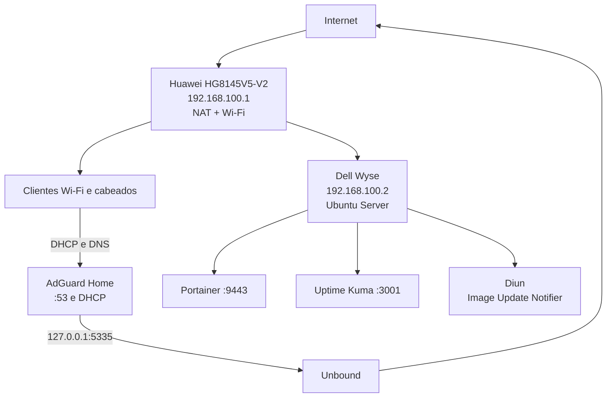

# 00 — Arquitetura

## Objetivo

Transformar o Dell Wyse em servidor de infraestrutura doméstica, mantendo o Huawei HG8145V5-V2 como gateway, NAT e ponto de acesso Wi-Fi.

## Responsabilidades

### Huawei HG8145V5-V2

- acesso à Internet;
- NAT;
- Wi-Fi;
- gateway da rede em `192.168.100.1`;
- DHCP desativado após a migração para o AdGuard Home.

### Dell Wyse

- Ubuntu Server 24.04 LTS;
- IP estático `192.168.100.2`;
- Docker, Portainer, Uptime Kuma e Diun;
- AdGuard Home como DNS e DHCP;
- Unbound como resolvedor DNS recursivo local.

## Topologia



## Fluxo DHCP

1. O cliente entra na rede.
2. O AdGuard Home entrega:
   - IP no pool `192.168.100.50-192.168.100.200`;
   - máscara `/24`;
   - gateway `192.168.100.1`;
   - DNS `192.168.100.2`;
   - domínio local `home.arpa`.
3. Reservas DHCP mantêm IPs previsíveis para notebooks, TVs e dispositivos importantes.

## Fluxo DNS

```text
Cliente -> AdGuard Home -> Unbound -> servidores raiz/autoritativos
```

O AdGuard aplica listas de bloqueio e regras locais. Consultas permitidas seguem para o Unbound, que resolve recursivamente e mantém cache local.

## Atualizações de containers

O Diun consulta o registry e detecta mudanças nas imagens Docker marcadas com `diun.enable=true`.

Ele não atualiza containers automaticamente. A atualização é feita manualmente em janela de manutenção, após revisão e backup.

## Endereçamento de referência

| Recurso | Endereço |
|---|---|
| Rede | `192.168.100.0/24` |
| Gateway/modem | `192.168.100.1` |
| Dell Wyse | `192.168.100.2` |
| DHCP final | AdGuard Home |
| Pool DHCP final | `192.168.100.50-192.168.100.200` |
| Unbound | `127.0.0.1:5335` |

## Restrições e boas práticas

- O Wyse deve operar por cabo Ethernet.
- Não exponha Portainer, Uptime Kuma ou AdGuard à Internet.
- Não configure port forwarding no modem para esses serviços.
- Mantenha anotada uma configuração de IP manual para recuperação.
- Faça backup antes de atualizar serviços críticos.
- Não automatize atualização de DNS/DHCP.

## Ordem segura de implantação

1. Instalar Ubuntu.
2. Definir IP estático.
3. Instalar Docker e Portainer.
4. Instalar e testar Unbound.
5. Instalar e testar AdGuard como DNS.
6. Configurar DHCP no AdGuard, ainda desativado.
7. Desativar DHCP do modem.
8. Ativar DHCP do AdGuard.
9. Renovar leases dos clientes e validar.
10. Instalar Uptime Kuma.
11. Instalar Diun para detecção controlada de novas imagens.
12. Aplicar firewall, backup e rotinas de manutenção.
